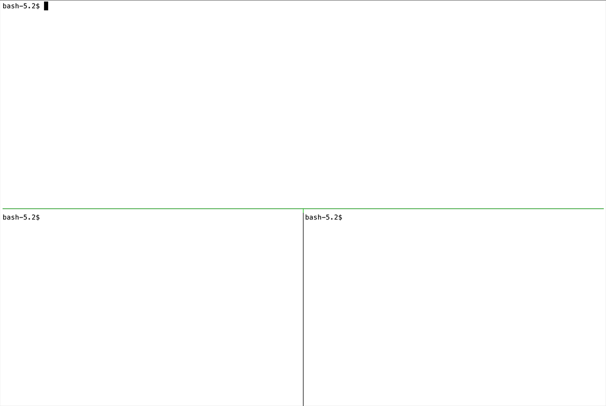

# Aeron.io Quick Start

A Cluster and command line client built using Aeron Cluster.

# Running

Running the samples in Docker is the easiest way to get started. See the [docker readme](docker/readme.md) for more details.

## Local

- run `./gradlew` to build the code
- in one terminal, run `./gradlew runSingleNodeCluster`
- in another terminal, run the admin application. See [admin readme](admin/readme.md) for more details.

# Development requirements

- Java 17 (Zulu 17.0.7 was used for development)
- Gradle 8.1.1

# Runtime requirements

- Linux/macOS (if you want to run the samples in your local environment; windows currently untested)
- Docker Compose 2.x - see [docker readme](docker/readme.md) for more details
- Kubernetes 1.26.x  - see [kubernetes readme](kubernetes/readme.md) for more details
- Minikube 1.30.x - if running Kubernetes with minikube. See [kubernetes readme](kubernetes/readme.md) for more details
